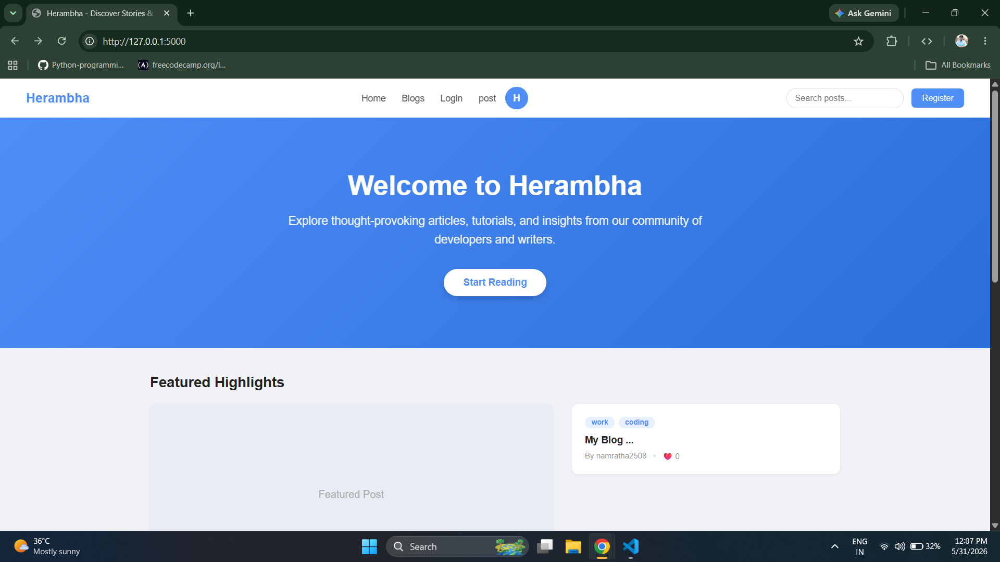
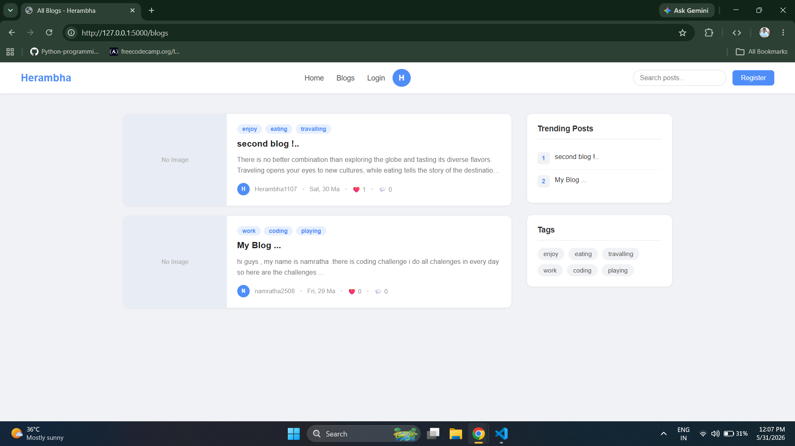
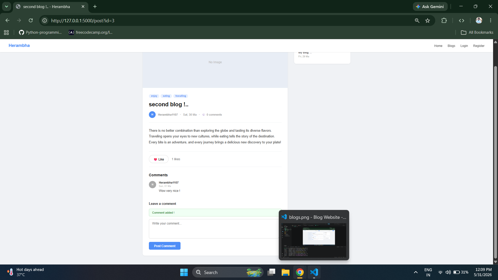
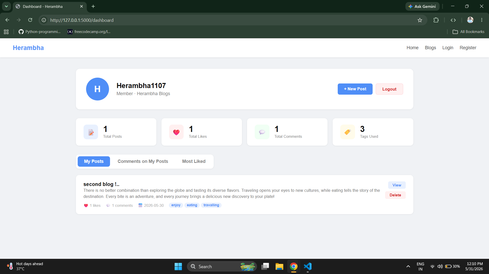

# Herambha Flask Blogging Website
A full-stack blogging platform built with flask where user can register,publish posts,like and comment.This Web App is built with
python flask,HTML,CSS,JS (JavaScript).

---
## Features
- User Register with OTP email verification
- Login / LogOut with flask login management
- Like and Unlike posts
- Comment on posts
- Search posts by title,content or author
- User dashboard with stats
- Delete your own posts
---

## Technologies are Used
```
Backend  -> Python,Flask,SQLALchemy,Flask-Login,Flask-Mail,
Frontend -> HTML,CSS,JavaScript
Database -> PostgreSQL (Supabase)  
Auth     -> OTP Email Verification, Flask-Login session
Deploy   -> Render
```
---
## WebSite Live Link
[herambha-flask-blog.onrender.com](https://herambha-flask-blog.onrender.com/)

---
## Screenshots
### Home Page


### All Blogs Page


### Read Post


### User Dashboard


---
## What i Learned  
- How Flask Blueprints work for organizing and splitting routes into multiple files
- How to use SQLAlchemy ORM with database relationships (one-to-many, many-to-many)
- How to send emails using Flask-Mail with HTML email templates
- How to manage user sessions with Flask-Login (login, logout, remember me)
- How to build a REST API with JSON responses
- How to protect routes using authentication and the `@login_required` decorator
- How to validate user input using WTForms validators (DataRequired, Email, Length, EqualTo)
- How to protect forms from Cross-Site Request Forgery (CSRF) attacks using Flask-WTF

---
## My First Blog in My Website
[Read My Blog](https://herambha-flask-blog.onrender.com/post?id=1)

---

## Known Issue

> Email OTP is currently shown on screen instead of being sent to email
> because Render free tier blocks all outgoing SMTP ports (587, 465, 25).
> This will be fixed when migrating to a paid plan or PythonAnywhere.

---
## Author
[@Herambha1226](https://github.com/Herambha1226)
